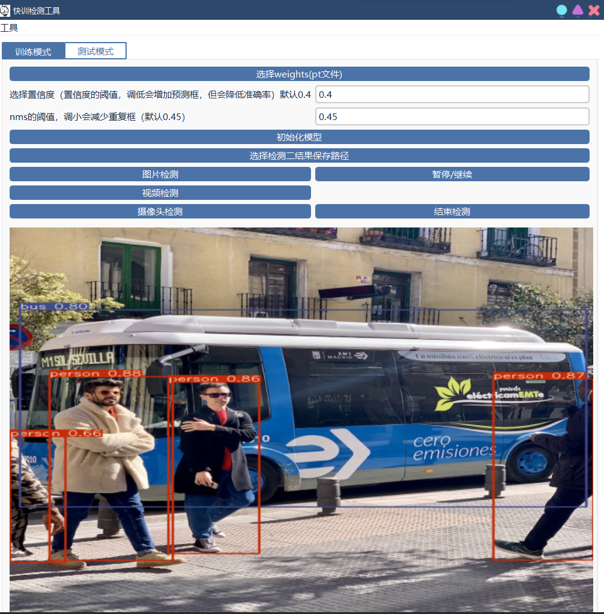

# yolov5_and_gui
去年寒假用pyqt写的可视化界面
训练的健壮性可能不是很好
#### 介绍
用pyqt5在yolov5上加了个可视化界面

#### 软件架构
软件架构说明

#### 安装教程

1.  pip install -r requirements.txt 安装相应环境
2.  运行window.py

#### 使用说明

1.  运行windowpy
训练界面

检测界面

2 检测模式
选择weights文件（weights文件在weights目录下）
然后输入置信度和nms
初始化模型
选择结果保存路径
3
演示一下图片检测

#### 参与贡献

1.  Fork 本仓库
2.  新建 Feat_xxx 分支
3.  提交代码
4.  新建 Pull Request

#### 特技

1.  使用 Readme\_XXX.md 来支持不同的语言，例如 Readme\_en.md, Readme\_zh.md
2.  Gitee 官方博客 [blog.gitee.com](https://blog.gitee.com)
3.  你可以 [https://gitee.com/explore](https://gitee.com/explore) 这个地址来了解 Gitee 上的优秀开源项目
4.  [GVP](https://gitee.com/gvp) 全称是 Gitee 最有价值开源项目，是综合评定出的优秀开源项目
5.  Gitee 官方提供的使用手册 [https://gitee.com/help](https://gitee.com/help)
6.  Gitee 封面人物是一档用来展示 Gitee 会员风采的栏目 [https://gitee.com/gitee-stars/](https://gitee.com/gitee-stars/)
